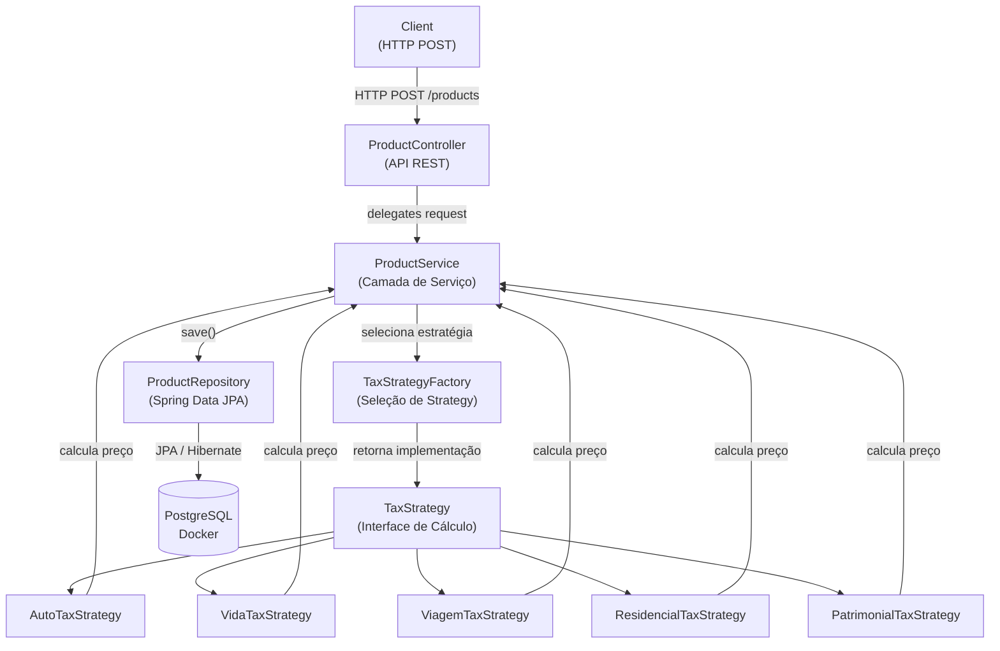
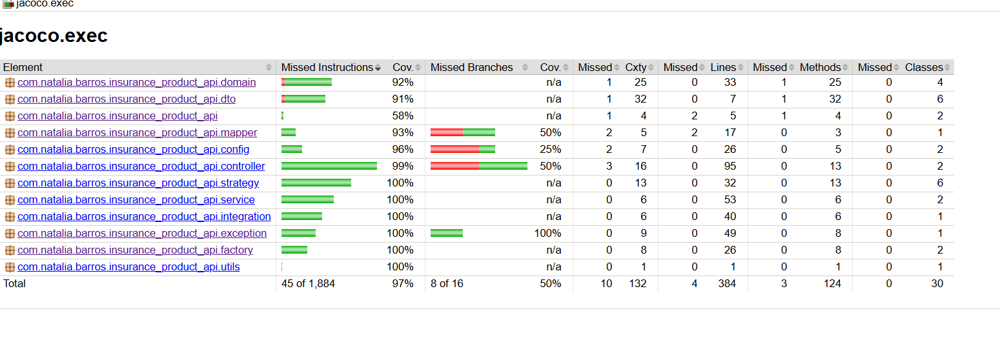

# Insurance Product API

API REST para criação de produtos de seguro com cálculo automático de preço tarifado baseado na categoria do seguro.

A aplicação foi desenvolvida utilizando Java + Spring Boot, seguindo boas práticas de arquitetura, validação de dados, 
testes automatizados e observabilidade.

----

## Arquitetura da Aplicação

A aplicação segue uma arquitetura em camadas:



##### Responsabilidades:

| Camada | Responsabilidade                                                                                                                                                                         |
|------|------------------------------------------------------------------------------------------------------------------------------------------------------------------------------------------|
| Controller | Expor endpoints REST e receber requisições HTTP                                                                                                                                          |
| DTO | Representar os dados de entrada e saída da API e validações dos atributos                                                                                                                |
| Service | Orquestrar o fluxo da aplicação e coordenar as regras de negócio                                                                                                                         |
| Domain | Representar as entidades do domínio da aplicação e encapsulamento das regras de negócio                                                                                                                                        |
| Strategy | Implementar o cálculo de impostos por categoria de produto                                                                                                                               |
| Factory | Resolver e fornecer a implementação correta de `TaxStrategy` de acordo com a categoria do produto                                                                                                                                 |
| Repository | Persistir e recuperar dados do banco PostgreSQL                                                                                                                                          |
| Mapper | Converter DTOs para entidades de domínio e vice-versa                                                                                                                                    |
| Exception | Centralizar tratamento de erros da aplicação                                                                                                                                             |
| Config | Configurações da aplicação e beans do Spring, incluindo filtros HTTP (CorrelationIdFilter) <br/>para rastreabilidade de requisições e configuração de mensagens para internacionalização |
| Utils | Funções auxiliares reutilizáveis, como arredondamento de valores monetários (`BigDecimal`)                                                                                               |

---	
## Padrões de Projeto Utilizados

### Strategy Pattern

O cálculo do preço tarifado varia conforme a categoria do seguro.
Para evitar condicionais complexas (if/else ou switch), foi aplicado o **Strategy Pattern**.

Cada categoria possui sua própria estratégia de cálculo.

Exemplo:
````
TaxStrategy
├─ AutoTaxStrategy
├─ VidaTaxStrategy
├─ ViagemTaxStrategy
├─ ResidencialTaxStrategy
└─ PatrimonialTaxStrategy
````
Isso permite adicionar novas categorias sem modificar código existente, seguindo o princípio **Open/Closed** do **SOLID.**.

### Factory Pattern

A classe `TaxStrategyFactory` atua como uma **Simple Factory**, responsável por selecionar dinamicamente 
a implementação correta de `TaxStrategy` com base na categoria do produto.

Isso evita acoplamento entre a camada de serviço e as implementações específicas de cálculo.

---

## Decisões de Arquitetura
### Uso de Factory para seleção de Strategy

Embora o Spring permita resolver automaticamente as implementações de `TaxStrategy` através de injeção de 
dependência (`List<TaxStrategy>` ou `Map<String, TaxStrategy>`), foi utilizada uma classe `TaxStrategyFactory`.

A decisão foi tomada para:

- Tornar explícita a lógica de seleção da estratégia
- Evitar acoplamento da camada de serviço com o container do Spring
- Deixar claro no projeto o uso dos padrões **Strategy** e **Factory**

Essa abordagem também facilita a leitura da arquitetura e a compreensão das responsabilidades de cada componente.

### Por que não utilizar Chain of Responsibility
O padrão **Chain of Responsibility** foi considerado durante o desenho da solução.

Esse padrão é mais adequado quando uma requisição precisa passar por múltiplos handlers em sequência, onde cada 
componente pode processar ou modificar a requisição antes de passá-la adiante.

No caso deste projeto, existe uma correspondência direta entre a categoria do produto e a regra de cálculo de imposto.
Apenas uma estratégia deve ser aplicada por vez.

Dessa forma, o uso do Strategy Pattern se mostrou mais simples e adequado para resolver o problema.

### Uso de Factory em vez de Injeção Automática de Beans
Embora o Spring Framework ofereça mecanismos poderosos de injeção de dependências que permitem resolver automaticamente implementações de uma interface.

Neste projeto optei por implementar explicitamente uma Factory (TaxStrategyFactory) para a seleção das estratégias de cálculo.

Essa decisão foi tomada por alguns motivos arquiteturais e didáticos.

Em resumo, a escolha por uma TaxStrategyFactory manual foi motivada por:

- Tornar explícita a aplicação dos padrões Strategy e Factory

- Manter a responsabilidade de seleção das estratégias centralizada

- Evitar acoplamento direto da lógica de negócio ao container do Spring

- Facilitar a compreensão arquitetural do projeto

---
### Tecnologias Utilizadas

- Java 17

- Spring Boot

- Spring Data JPA

- Hibernate

- PostgreSQL

- Flyway

- Docker

- Micrometer (observabilidade e métricas)

- Spring Boot Actuator (observabilidade e métricas)

- JUnit (testes unitários)

- Mockito (mock de dependências)

- MockMvc (testes de controller)

- Jacoco (cobertura de testes)


---

### Banco de Dados

O banco de dados utilizado é PostgreSQL executado em container Docker.

O versionamento do banco é gerenciado pelo Flyway, garantindo controle de migrações.

#### Credenciais padrão para ambiente local:

Host: localhost  
Porta: 5432  
Database: insurance  
User: postgres  
Password: postgres

#### Banco de Dados teste
Teste utiliza banco H2:

spring.datasource.url=jdbc:h2:mem:testdb

spring.datasource.driverClassName=org.h2.Driver

spring.datasource.username=sa

spring.datasource.password=teste

---

### Endpoint da API
Endpoints disponíveis em **doc/postman/insurence_product_api.postman_collection.json**:
##### Criar Produto

POST
````
/products
````

##### Exemplo de Request

````
{
  "nome": "Seguro de Auto Individual",
  "categoria": "AUTO",
  "preco_base": 1000.00
}
````

##### Exemplo de Response

````
{
  "id": "9285381c-1dba-4bce-94bd-625de3068edd",
  "nome": "Seguro de Auto Individual",
  "categoria": "AUTO",
  "preco_base": 1000.00,
  "preco_tarifado": 1105.00
}
````
O campo preco_tarifado é calculado automaticamente pela aplicação.


---

### Validação de Dados
A API utiliza **Bean Validation** para garantir integridade dos dados de entrada.

Validações aplicadas:

| Campo      | Validação      |
| ---------- | -------------- |
| nome       | obrigatório    |
| categoria  | obrigatório    |
| preco_base | maior que zero |

Exemplo de erro de validação:
````
{
    "status": 400,
    "error": "Validation Error",
    "errors": [
        {
            "field": "nome",
            "message": "Nome é obrigatório"
        }
    ]
}
````

---

### Tratamento de Erros

A aplicação possui um Global Exception Handler responsável por centralizar o tratamento de exceções.

Tipos de erro tratados:

| Tipo             | Descrição                 |
| ---------------- | ------------------------- |
| Validation Error | erros de validação        |
| Business Error   | erros de regra de negócio |
| Internal Error   | erros inesperados         |

---

### Observabilidade

A aplicação possui recursos de observabilidade utilizando Spring Boot Actuator.

Endpoints disponíveis em **doc/postman/metrics.postman_collection.json**:

````
/actuator/health
/actuator/metrics
/actuator/metrics/http.server.requests
````

---

### Logging e Rastreamento de Requisições

Foi implementado um Correlation ID Filter que gera um identificador único para cada requisição.

Esse identificador permite rastrear toda a execução da requisição nos logs.

Exemplo:

````
REQUEST POST /products
Creating product
Product created successfully
RESPONSE POST /products 201 18ms
````

O log também registra o tempo total da requisição, permitindo análise de performance.

---

### Testes Automatizados

A aplicação possui três níveis de testes:

#### Testes Unitários

Validam regras de negócio e cálculos de impostos.

#### Testes de Controller

Validam requisições HTTP, validação de dados e respostas da API.

#### Testes de Integração

Testam o fluxo completo da aplicação.

### Cobertura de testes



---

### Performance

Foram executadas múltiplas requisições ao endpoint /products.

Métricas coletadas via Actuator:

| Métrica              | Valor   |
| -------------------- | ------- |
| Total de requisições | 31      |
| Tempo total          | 1.19 s  |
| Latência média       | ~38 ms  |
| Latência máxima      | ~372 ms |

A latência média observada (~38 ms) é considerada excelente para APIs REST com banco de dados.

O maior tempo registrado ocorreu durante as primeiras requisições devido ao processo de warm-up do Hibernate e 
lentidão do computador , mais container Docker.

---

### Como Executar o Projeto

#### Clonar repositório

````
git clone https://github.com/Natalia0412/insurance-product-api.git
````

#### Subir banco com Docker

````
docker-compose up -d
````

#### Executar aplicação
````
mvn spring-boot:run
````
#### Executar o teste 
````
mvn test
````

---

## Test Coverage

Para gerar o relatório de cobertura de testes:
````
mvn clean verify
````

O relatório será gerado em:

target/site/jacoco/index.html


------

### Posssíveis evoluções futuras

- Monitoramento com Prometheus e Grafana
  - Atualmente a aplicação expõe métricas utilizando Spring Boot Actuator e Micrometer.
  - Como evolução, essas métricas poderiam ser exportadas para ferramentas de monitoramento como Prometheus, 
  - permitindo visualização em dashboards no Grafana.
- Métricas de Negócio
  - Além das métricas técnicas, poderiam ser adicionadas métricas de negócio, como:
  - quantidade de produtos criados
  - número de erros de validação
  - volume de requisições por categoria de seguro
- volume de requisições por categoria de seguro
  - Dependendo do volume de requisições, poderia ser implementado cache para reduzir acessos ao banco de dados.
- Containerização Completa da Aplicação
  - Atualmente apenas o banco de dados está containerizado.
  - Como melhoria, a própria aplicação poderia ser executada em container Docke
